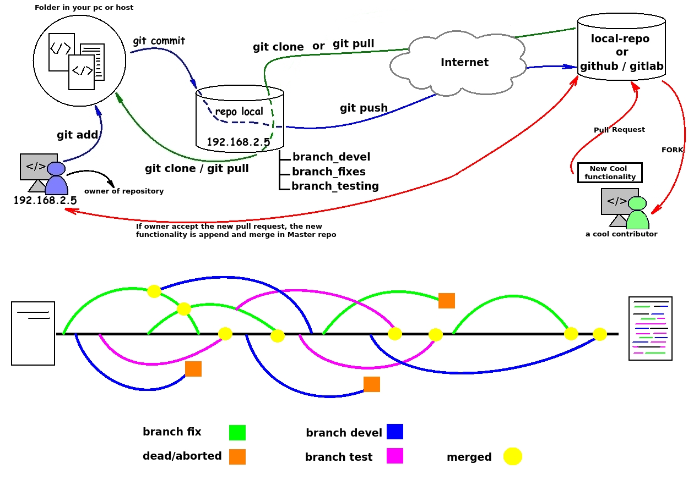
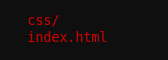
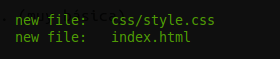

### Case of use
	I need install and configure a git repository to save the code of my website and then have control of my versions.
	As well I use this repo as a link between production-server (a web server) and Jenkins, to do a deploy after every satisfactory pull

### The used hardware 
	SO:  debian-8.7.1-amd64-netinst
	HDD: 8Gb
	RAM: 1Gb
	CPU: 1
	  
	I assume you have Debian already installed ...

### Update the sistem
	apt-get update && apt-get upgrade -y && apt-get dist-upgrade -y

### Install basic packages (Only git is necessary, the rest of packages is to my like)
	apt-get install -y git vim mlocate net-tools

### To do not use root user, I create a new user named developer01 
	adduser developer01
		Adding user `developer01' ...
		Adding new group `developer01' (1001) ...
		Adding new user `developer01' (1001) with group `developer01' ...
		Creating home directory `/home/developer01' ...
		Copying files from `/etc/skel' ...
		Enter new UNIX password: 
		Retype new UNIX password: 
		passwd: password updated successfully
		Changing the user information for developer01
		Enter the new value, or press ENTER for the default
			Full Name []: developer01
			Room Number []: 
			Work Phone []: 
			Home Phone []: 
			Other []: 
		Is the information correct? [Y/n] Y

### Access how developer01 user.
	su - developer01

### I create a directory for my new repository
	mkdir /home/developer01/git

### I configure the repo
	cd /home/developer01/git/
	git init 
	git config --global color.status auto 
	git config --global color.branch auto 
	git config --global color.diff auto
	git config --global color.intteractive auto
	git config core.sharedRepository true
	git config receive.denyCurrentBranch ignore 
	git --bare init
	git config --global user.email "mi_correo@dominio.com"
	git config --global user.name "Jonathan Prado"
	 
	Initialized empty Git repository in /home/developer01/git/.git/
	Initialized empty Git repository in /home/developer01/git/

### Info: :information_source:
	Ok, up to this point I have created my repository, but is empty.
	Well I be now go to other computer to  create and upload the code of my site 
	Now I no longer have to access this server.

### Configuration of remote repo.     (:
	I have my site hosted in my computer, in /var/www/html/cat/*

### Initialice the LOCAL repo
	git init 
		Initialized empty Git repository in /var/www/html/cat/.git/
	

### Info:
	In this moment the code is in my personal computer (my remote git repo is empty).
	Here, the idea is using git commands (git add/commit/pull) to upload the local code to remote git repo.
	After execute "git pull ... " the code will be in the remote git repo.  
	Here an image to ilustrate idea (very basic)

### I add all files (index and directories)
	git add *

### I add mi remote git repo
	git remote add origin git+ssh://developer01@192.168.2.101/home/developer01/git

### I check the status.
	git status

### Info: 
	In general, when dont have files and execute "git status", the system show in red color the files that are not loaded. And after execute "git add ..." the system show files in green color

### I check the remote repo full path
	git remote -v
	origin	git+ssh://developer01@192.168.2.101/home/developer01/git (fetch)
	origin	git+ssh://developer01@192.168.2.101/home/developer01/git (push)

### I create my first commit with a basic text as a reference.
	git commit -m " Agrego todo mi sitio completo"
	[master (root-commit) 618d46f]  Agrego todo mi sitio completo
	 2 files changed, 294 insertions(+)
	 create mode 100755 css/style.css
	 create mode 100755 index.html

### I check the log of my recent "commit".
	git log
		commit 618d46f25935fa8367df6db8ea753bd0af67dbbb
		Author: Jonathan Prado <mi_correo@dominio.com>
		Date:   Wed Apr 29 23:21:19 2017 -0300

		     Agrego todo mi sitio completo

### I generate a firs pull to remote git repo.
	git push origin master
		developer01@192.168.2.101's password: 
		Counting objects: 5, done.
		Delta compression using up to 4 threads.
		Compressing objects: 100% (4/4), done.
		Writing objects: 100% (5/5), 1.73 KiB | 0 bytes/s, done.
		Total 5 (delta 0), reused 0 (delta 0)
		To git+ssh://developer01@192.168.2.101/home/developer01/git
		 * [new branch]      master -> master

### Info:
	After execute "git pull ..." I already have my code on my remote git repo.
	If you prefer, you can delete the local code, because you can clone it anytime using "git clone ..."

### Extra:
	Ok, imagine you have another programmer (developer02), and he need add a new functionality to the code.
	He, only need clone the repo, work over the code and follow the anterior steps (add,commit,pull) to build the new code.

  	

### Clone the remote repo git in /tmp/cat
	git clone https://github.com/jpradoar/my_project_repo.git

### To work more comfortable and avoid treading the code I already have, I will create a new branch.
	git checkout -b desarrollo

### Work in the funcion (in this example only create a simple file with text )
	echo "add_new_function_to_code" >>new_funcion.txt

### Add all new created files
	git add *

### Create a commit to explain the job
	git commit -m " Add new function"
	
### Push changes to desarrollo branch. 
	git push origin desarrollo

### Merge the branch desarrollo
	git merge desarrollo
		Updating 4a66541..ad442ba
		Fast-forward
		 new_funcion.txt | 1 +
		 1 file changed, 1 insertion(+)
		 create mode 100644 new_funcion.txt

### Info: :information_source:
	For example, developer02  add a small function to the code and some comments.  
	Now developer02 need "pull" the changes and, if the code is correct, any developer can run a "merge" to update changes in the master repository. 
	In this point, be can use Jenkins to deploy after pull on the master repository.
	basic example 

	developer01 ---> create_project ---> git add ---> git commit ---> git pull origin master --->  [CODE IN GIT] 

	developer02 ---> git clone ---> git branch --- {modify the project code} ---> git add ---> git commit ---> git pull origin branch --->  [CODE IN GIT] ---> [CODE MODIFIED IN GIT-BRANCH]

	developerXX ---> git merge { [CODE IN GIT]+[CODE MODIFIED IN GIT-BRANCH] } ---> [[ NEW CODE UPDATED ]]

:construction: :construction: :construction:
### FALTA DOCUMENTAR EL PROCEDIMIENTO DE FORK
	Documentación del procedimiento de fork para contribuir en otro repo! :D 

:construction: :construction: :construction:
###  (pendiente de implementar)
	GIT WEB
	https://leninmhs.wordpress.com/2014/01/19/git-gitolite-gitweb/
	https://dereenigne.org/debian/debian-gitweb-server/
	https://packages.debian.org/jessie/gitweb

### Referencias:
	https://git-scm.com/
	https://github.com/git/git
	https://www.kernel.org/pub/software/scm/git/docs/gitweb.conf.html
	https://www.howtoinstall.co/es/debian/jessie/gitweb

